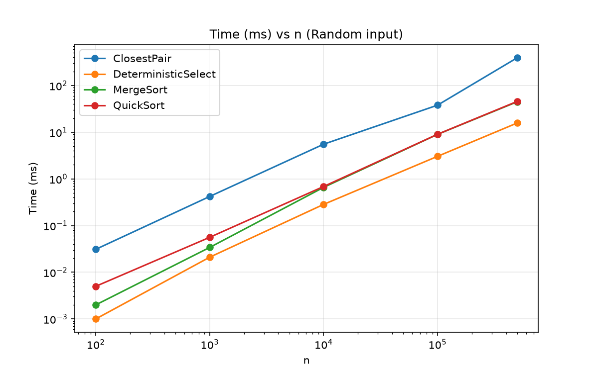
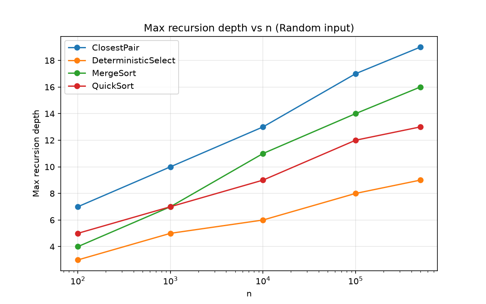
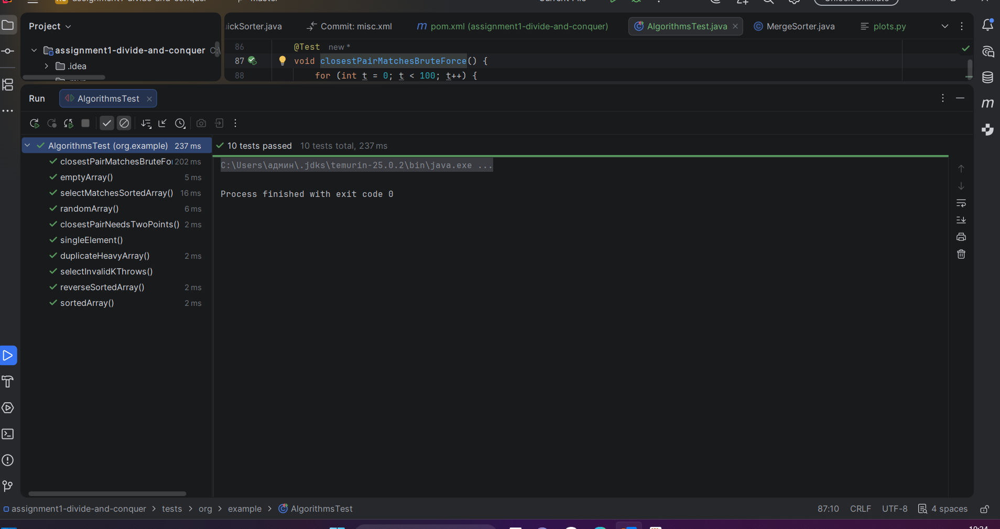
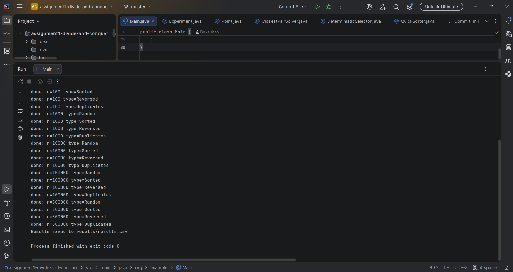

# Assignment 1: Divide-and-Conquer Algorithm Analysis

## A. Project Overview

The goal of this assignment is to implement four classic divide-and-conquer
algorithms in Java, analyze their running time with recurrences, measure them
on different inputs, and compare theory with practice.

Implemented algorithms:
1. **MergeSort** (linear merge, reusable buffer, insertion-sort cutoff = 16)
2. **QuickSort** (random pivot, in-place 3-way partition, recurse on the smaller part)
3. **Deterministic Select** (median-of-medians, groups of 5, in-place)
4. **Closest Pair of Points** (sort by x, divide and conquer, strip check by y)

Project structure: `src/main/java` (code), `tests/` (JUnit tests),
`results/results.csv` (measurements), `docs/plots` and `docs/screenshots`.

How to run: run `Main.java` (it runs all checks and the experiment and writes
`results/results.csv`), then `python plots.py` to build the plots.

## B. Algorithm Analysis

### MergeSort
Split the array in half, sort each half recursively, merge two sorted halves in
linear time. One auxiliary buffer is created once and reused. Parts of size <= 16
are sorted with insertion sort.
- Recurrence: T(n) = 2T(n/2) + Θ(n)
- Master Theorem: a = 2, b = 2, f(n) = n = n^(log2 2), so case 2 gives **Θ(n log n)**
- Space: Θ(n) (buffer). Recursion depth: about log2(n/16)

### QuickSort
Choose a random pivot, partition in place into `< pivot`, `== pivot`, `> pivot`,
recurse into the smaller part and loop over the larger part.
- Average: T(n) = 2T(n/2) + Θ(n) = **Θ(n log n)**
- Worst case: T(n) = T(n-1) + Θ(n) = **O(n²)** (very unlikely with a random pivot)
- Space: O(log n) stack, because we always recurse into the smaller part

### Deterministic Select (Median of Medians)
Split into groups of 5, take the median of each group, find the median of these
medians recursively (this is the pivot), partition, and continue only in the part
that contains the k-th element.
- Recurrence: T(n) <= T(n/5) + T(7n/10) + Θ(n)
- Since 1/5 + 7/10 = 9/10 < 1, the work shrinks geometrically. By Akra–Bazzi
  intuition the solution is **Θ(n)** in the worst case
- Space: O(log n) recursion for the medians

### Closest Pair of Points
Sort points by x once. Split into two halves, find the closest distance d in each
half, merge halves by y, build a strip of points closer than d to the middle line,
and compare each strip point only with the next points whose y-difference is < d
(at most a constant number of them).
- Recurrence: T(n) = 2T(n/2) + Θ(n) = **Θ(n log n)**
- Space: Θ(n)

## C. Experimental Results

Setup: sizes n = 100, 1 000, 10 000, 100 000, 500 000; input types Random, Sorted,
Reversed, Duplicates (Closest Pair: Random and Duplicates only). Each time is the
median of 5 runs after a JVM warm-up, measured with `System.nanoTime()`. The measured
time includes `clone()` of the input array, which is negligible compared with the
sorting itself. Metrics: time (ms), max recursion depth, comparisons (for Closest
Pair: distance computations).

### Execution time (ms), Random input

| Algorithm            | n=100 | n=1 000 | n=10 000 | n=100 000 | n=500 000 |
|----------------------|------:|--------:|---------:|----------:|----------:|
| MergeSort            | 0.002 |   0.031 |    0.700 |     8.420 |    49.545 |
| QuickSort            | 0.005 |   0.056 |    0.694 |     8.112 |    45.756 |
| Deterministic Select | 0.001 |   0.015 |    0.297 |     3.052 |    15.514 |
| Closest Pair         | 0.024 |   0.374 |    6.119 |    39.960 |   357.877 |

### Max recursion depth, Random input

| Algorithm            | n=100 | n=1 000 | n=10 000 | n=100 000 | n=500 000 |
|----------------------|------:|--------:|---------:|----------:|----------:|
| MergeSort            |     4 |       7 |       11 |        14 |        16 |
| QuickSort            |     5 |       7 |        9 |        11 |        13 |
| Deterministic Select |     3 |       5 |        6 |         8 |         9 |
| Closest Pair         |     7 |      10 |       13 |        17 |        19 |

### Other input types

Results for n = 500 000 (Closest Pair was tested on Random and Duplicates only).

| Algorithm            | Input      | Time (ms) | Max depth | Comparisons |
|----------------------|------------|----------:|----------:|------------:|
| MergeSort            | Random     |    49.545 |        16 |   9 223 054 |
| MergeSort            | Sorted     |    10.503 |        16 |   3 758 928 |
| MergeSort            | Reversed   |    17.697 |        16 |   7 201 436 |
| MergeSort            | Duplicates |    23.491 |        16 |   8 718 270 |
| QuickSort            | Random     |    45.756 |        13 |  11 707 041 |
| QuickSort            | Sorted     |    22.881 |        13 |  11 872 603 |
| QuickSort            | Reversed   |    22.517 |        13 |  11 298 614 |
| QuickSort            | Duplicates |     6.389 |         4 |   1 799 945 |
| Deterministic Select | Random     |    15.514 |         9 |   3 297 539 |
| Deterministic Select | Sorted     |     8.446 |         9 |   2 403 463 |
| Deterministic Select | Reversed   |     8.435 |         9 |   3 457 173 |
| Deterministic Select | Duplicates |    11.217 |         9 |   2 111 365 |
| Closest Pair         | Random     |   357.877 |        19 |     591 393 |
| Closest Pair         | Duplicates |   276.978 |        19 |     441 627 |

### Plots

## D. Discussion

**Do the results match theory?**
Mostly yes. When n grows 5 times (100 000 → 500 000), an n·log n algorithm should
become about 5.7 times slower, and a linear one 5 times slower.
- MergeSort: 8.42 → 49.5 ms (5.9x). Comparisons are about 0.97·n·log2(n).
- QuickSort: 8.11 → 45.8 ms (5.6x). Comparisons are about 1.24·n·log2(n), a bit more
  than MergeSort, but the time is almost the same because QuickSort works in place.
- Deterministic Select: 3.05 → 15.5 ms (5.1x), and comparisons stay near 6.6·n for
  large n (6.7n at 100 000, 6.6n at 500 000). This is the linear behaviour predicted
  by Θ(n). At n = 500 000 it is about 3 times faster than sorting.
- Recursion depth grows by about 2 levels when n grows 5 times (log2 5 ≈ 2.3) for
  all algorithms. QuickSort depth is 13 at n = 500 000, much smaller than log2(n) ≈ 19,
  so the smaller-first recursion works.
- Closest Pair is the least clean case: time grew 9x (40 → 358 ms), more than the 5.7x
  predicted for n·log n. Distance computations are only about 1.2·n, so most of the
  time is spent in sorting and merging by y, and probably in memory allocation and
  cache effects on large arrays (we did not measure this separately). The growth is
  still close to n·log n and far from n².

Very small inputs (n = 100, 1 000) take microseconds, so those numbers are noisy
because of timer resolution and JIT.

**How does input structure affect performance?**
- MergeSort: Sorted input is fastest (10.5 ms vs 49.5 ms for Random). During each
  merge one half runs out early, so comparisons drop from 9.2M to 3.8M, and branches
  are easy to predict. Reversed (17.7 ms) is also cheaper than Random. The complexity
  stays Θ(n log n) for every input.
- QuickSort: Sorted and Reversed are not slow (about 22.7 ms, faster than Random at
  45.8 ms). The random pivot avoids the O(n²) case, and depth is 13 for all of them.
  Duplicates are the fastest (6.4 ms, depth 4, 1.8M comparisons) because the 3-way
  partition puts all equal elements in the middle part, which is not sorted again.
- Deterministic Select: all inputs stay linear (8.4–15.5 ms). Random is the slowest
  and Sorted/Reversed are about 2 times faster, which is probably due to more
  predictable branches during partitioning.
- Closest Pair: Duplicates are faster than Random (277 vs 358 ms) and need fewer
  distance computations (442k vs 591k), because the best distance becomes very small
  and the strip contains few points.

**Why does smaller-first recursion help QuickSort?**
The recursive call always gets at most half of the elements, so the recursion depth
is at most log2(n). The larger part is handled by a loop, which does not grow the
stack. Without this, a bad pivot sequence could give depth O(n) and a stack overflow.

**Why does Median-of-Medians guarantee O(n)?**
The pivot is greater than at least 3n/10 elements and smaller than at least 3n/10
elements, so the remaining part has at most 7n/10 elements. Then
T(n) <= T(n/5) + T(7n/10) + cn, and because 1/5 + 7/10 < 1 the total work is a
geometric series that sums to O(n).

**Why is divide-and-conquer Closest Pair faster than O(n²)?**
Brute force checks all n(n-1)/2 pairs. The divide-and-conquer version only compares
points inside a narrow strip, and each point is compared with a constant number of
neighbours, so the merge step is linear and the total is Θ(n log n).

**Practical factors.**
JIT compilation (warm-up is needed), garbage collection pauses, CPU cache
(sequential array access in merge and partition is cache friendly), memory
allocation, and constant factors: Median-of-Medians has a large constant, so in
practice it is slower than randomized QuickSelect even though its worst case is better.

## E. Reflection

In this assignment I saw that a recurrence and the Master Theorem are not only
paper exercises: the measured growth of MergeSort, QuickSort and Select matched
Θ(n log n) and Θ(n) very well. The most useful results were the ones that showed
design decisions. Recursing into the smaller part kept QuickSort depth low, the
random pivot removed the bad case on sorted input, and the 3-way partition made
duplicates very cheap. It also showed me that constants matter: Median-of-Medians is
linear, but it does a lot of extra work per element, so its advantage over sorting is
about 3x, not a full log n factor.

Measuring in Java was harder than I expected. Without warm-up and several runs,
the JIT compiler and garbage collector made the results unstable, especially for
small n and for Closest Pair, where the growth was steeper than theory. If I
continued, I would compare Select with randomized QuickSelect and test Closest Pair
on more input types.

## F. Screenshots

